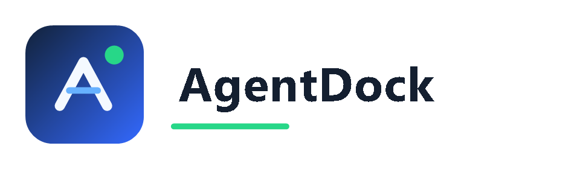
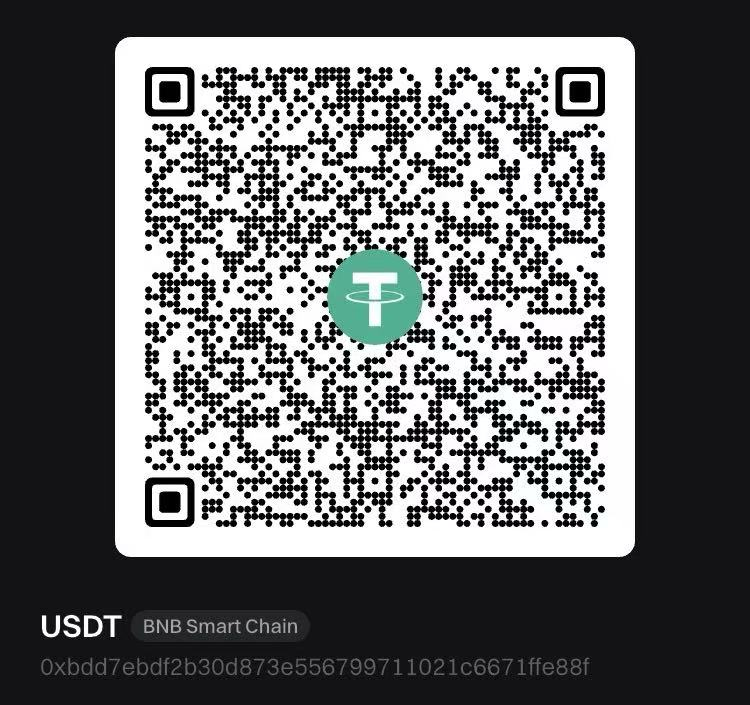

<p align="center">
  
</p>

<p align="center">
  OpenClaw & Hermes Agent Verwaltungspanel mit integriertem KI-Assistenten — Multi-Engine AI-Framework-Verwaltung
</p>

<p align="center">
  <a href="README.md">🇨🇳 中文</a> | <a href="README.en.md">🇺🇸 English</a> | <a href="README.zh-TW.md">🇹🇼 繁體中文</a> | <a href="README.ja.md">🇯🇵 日本語</a> | <a href="README.ko.md">🇰🇷 한국어</a> | <a href="README.vi.md">🇻🇳 Tiếng Việt</a> | <a href="README.es.md">🇪🇸 Español</a> | <a href="README.pt.md">🇧🇷 Português</a> | <a href="README.ru.md">🇷🇺 Русский</a> | <a href="README.fr.md">🇫🇷 Français</a> | <strong>🇩🇪 Deutsch</strong>
</p>

<p align="center">
  <a href="https://github.com/dfpo520-claw-bot/AgentDock/releases/latest">
    
  </a>
  <a href="https://github.com/dfpo520-claw-bot/AgentDock/releases/latest">
    
  </a>
</p>

---

<p align="center">
  
</p>

AgentDock ist ein visuelles Verwaltungspanel, das mehrere AI-Agent-Frameworks unterstützt, derzeit mit Dual-Engine-Unterstützung für [OpenClaw](https://github.com/1186258278/OpenClawChineseTranslation) und [Hermes Agent](https://github.com/nousresearch/hermes-agent). Mit einem **integrierten intelligenten KI-Assistenten**, der bei der Installation hilft, Konfigurationen automatisch diagnostiziert, Probleme behebt und Fehler korrigiert. 8 Werkzeuge + 4 Modi + interaktives Q&A — einfache Verwaltung für Anfänger und Experten.

> 🌐 **Website**: [github.com/dfpo520-claw-bot/AgentDock](https://github.com/dfpo520-claw-bot/AgentDock/) | 📦 **Download**: [GitHub Releases](https://github.com/dfpo520-claw-bot/AgentDock/releases/latest)

### 🎁 DeepAi助手 AI API

> Interne technische Testplattform, für ausgewählte Benutzer zugänglich. Tägliches Anmelden für Credits.

<p align="center">
  <a href="https://gpt.qt.cool"></a>
</p>

- **Tägliche Anmelde-Credits** — Tägliches Anmelden + Freunde einladen für Test-Credits
- **OpenAI-kompatible API** — Nahtlose Integration mit OpenClaw
- **Ressourcenrichtlinie** — Ratenbegrenzung + Anfragelimit, mögliche Warteschlange zu Stoßzeiten
- **Modellverfügbarkeit** — Modelle/APIs gemäß aktueller Seitenanzeige, Versionsrotation möglich

> ⚠️ **Compliance**: Nur für technische Tests. Illegale Nutzung oder Umgehung von Sicherheitsmechanismen ist verboten. Bewahren Sie Ihren API Key sicher auf. Regeln unterliegen den neuesten Plattformrichtlinien.

### 🔥 Entwicklerboard- / Embedded-Geräte-Unterstützung

- **Orange Pi / Raspberry Pi / RK3588** — `npm run serve` zum Ausführen
- **Docker ARM64** — `docker run ghcr.io/DeepAi助手/openclaw:latest`
- **Armbian / Debian / Ubuntu Server** — Automatische Architekturerkennung
- Kein Rust / Tauri / GUI erforderlich — **nur Node.js 18+**

## Community

Eine Community leidenschaftlicher KI-Agenten-Entwickler und -Enthusiasten — treten Sie bei!

<p align="center">
  <a href="https://discord.gg/U9AttmsNHh"><strong>Discord</strong></a>
  &nbsp;·&nbsp;
  <a href="https://github.com/dfpo520-claw-bot/AgentDock/discussions"><strong>Discussions</strong></a>
  &nbsp;·&nbsp;
  <a href="https://github.com/dfpo520-claw-bot/AgentDock/issues/new"><strong>Issue melden</strong></a>
</p>

## Funktionen

- **🤖 KI-Assistent (Neu)** — Integrierter KI-Assistent, 4 Modi + 8 Werkzeuge + interaktives Q&A
- **🧩 Multi-Engine-Architektur** — Unterstützt OpenClaw und Hermes Agent Dual-Engine, freies Umschalten, unabhängige Verwaltung
- **🤖 Hermes Agent Chat** — Integrierte Hermes Agent Chat-Oberfläche, Tool-Aufruf-Visualisierung, Dateizugriff, SSE-Streaming
- **🖼️ Bilderkennung** — Screenshots einfügen oder Bilder ziehen, KI analysiert automatisch
- **Dashboard** — Systemübersicht, Echtzeit-Service-Monitoring
- **Serviceverwaltung** — OpenClaw / Hermes Gateway starten/stoppen, Versionserkennung und Upgrade
- **Modellkonfiguration** — Multi-Provider-Verwaltung, Batch-Konnektivitätstests, Drag-Sortierung
- **Gateway-Konfiguration** — Port, Zugriffsbereich, Auth-Token, Tailscale
- **Nachrichtenkanäle** — Einheitliche Verwaltung von Telegram, Discord, Feishu, DingTalk, QQ
- **Kommunikation & Automatisierung** — Nachrichteneinstellungen, Broadcast, Webhooks, Ausführungsgenehmigung
- **Nutzungsanalyse** — Token-Verbrauch, API-Kosten, Modell-/Provider-Rankings
- **Agent-Verwaltung** — Agent-CRUD, Identitätsbearbeitung, Workspace-Verwaltung
- **Chat** — Streaming, Markdown-Rendering, Sitzungsverwaltung
- **Geplante Aufgaben** — Cron-basierte Ausführung, Mehrkanalzustellung
- **Log-Viewer** — Echtzeit-Logs aus mehreren Quellen und Suche
- **Speicherverwaltung** — Speicherdateien ansehen/bearbeiten, ZIP-Export, Agent-Wechsel
- **DeepAi助手 AI API** — Interne Testplattform, OpenAI-kompatibel
- **Erweiterungswerkzeuge** — cftunnel-Tunnelverwaltung, ClawApp-Statusüberwachung
- **Über** — Versionsinformationen, Community-Links, verwandte Projekte

## Download & Installation

Besuchen Sie [Releases](https://github.com/dfpo520-claw-bot/AgentDock/releases/latest) für die neueste Version:

| Plattform | Installer |
|----------|----------|
| **Windows** | `.exe` (empfohlen) oder `.msi` |
| **macOS Apple Silicon** | `.dmg` (aarch64) |
| **macOS Intel** | `.dmg` (x64) |
| **Linux** | `.AppImage` / `.deb` / `.rpm` |

### Linux-Server (Web-Version)

```bash
curl -fsSL https://raw.githubusercontent.com/dfpo520-claw-bot/AgentDock/main/scripts/linux-deploy.sh | bash
```

### Docker

```bash
docker run -d --name agentdock --restart unless-stopped \
  -p 1420:1420 -v agentdock-data:/root/.openclaw \
  node:22-slim \
  sh -c "apt-get update && apt-get install -y git && \
    npm install -g @DeepAi助手/openclaw-zh --registry https://registry.npmmirror.com && \
    git clone https://github.com/dfpo520-claw-bot/AgentDock.git /app && \
    cd /app && npm install && npm run build && npm run serve"
```

## Schnellstart

1. **Ersteinrichtung** — Beim ersten Start automatische Erkennung von Node.js, Git, OpenClaw. Ein-Klick-Installation bei Bedarf
2. **Modelle konfigurieren** — KI-Anbieter hinzufügen (DeepSeek, OpenAI, Ollama usw.) und Konnektivität testen
3. **Gateway starten** — Zur Serviceverwaltung gehen, „Starten" klicken. Grüner Status = bereit
4. **Chat starten** — Zum Live-Chat gehen, Modell auswählen und Gespräch beginnen

## Technische Architektur

| Schicht | Technologie | Beschreibung |
|---------|-----------|-------------|
| Frontend | Vanilla JS + Vite | Kein Framework, leichtgewichtig |
| Backend | Rust + Tauri v2 | Native Performance, plattformübergreifend |
| Kommunikation | Tauri IPC + Shell Plugin | Frontend-Backend-Brücke |
| Styling | Pure CSS (CSS Variables) | Dunkles/Helles Theme |

## Aus Quellcode bauen

```bash
git clone https://github.com/dfpo520-claw-bot/AgentDock.git
cd agentdock && npm install

# Desktop (erfordert Rust + Tauri v2)
npm run tauri dev        # Entwicklung
npm run tauri build      # Produktion

# Nur Web (kein Rust nötig)
npm run dev              # Hot Reload
npm run build && npm run serve  # Produktion
```

## Verwandte Projekte

| Projekt | Beschreibung |
|---------|-------------|
| [OpenClaw](https://github.com/1186258278/OpenClawChineseTranslation) | KI-Agenten-Framework |
| [ClawApp](https://github.com/DeepAi助手/clawapp) | Plattformübergreifender mobiler Chat |
| [cftunnel](https://github.com/DeepAi助手/cftunnel) | Cloudflare Tunnel Tool |

## Beitragen

Issues und Pull Requests sind willkommen. Siehe [CONTRIBUTING.md](CONTRIBUTING.md).


## Sponsor

If you find this project useful, consider supporting us via USDT (BNB Smart Chain):



```
0xbdd7ebdf2b30d873e556799711021c6671ffe88f
```

## Contact

- **Support**: [GitHub Issues](https://github.com/dfpo520-claw-bot/AgentDock/issues)
- **Website**: [github.com/dfpo520-claw-bot/AgentDock](https://github.com/dfpo520-claw-bot/AgentDock)
- **Product**: [github.com/dfpo520-claw-bot/AgentDock](https://github.com/dfpo520-claw-bot/AgentDock)
© 2026 DeepAi助手 | [github.com/dfpo520-claw-bot/AgentDock](https://github.com/dfpo520-claw-bot/AgentDock)
