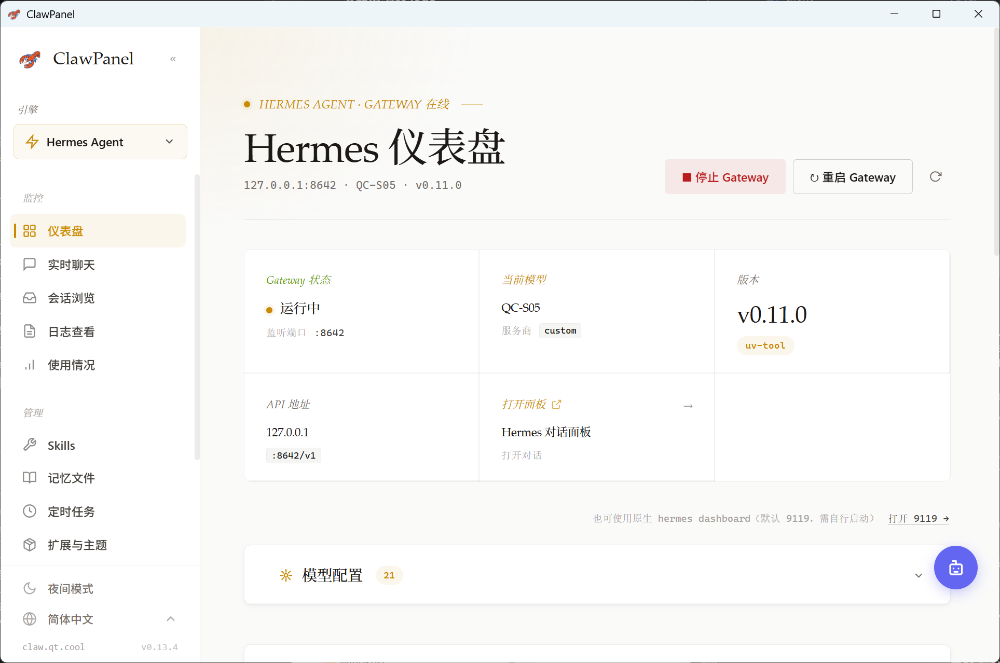
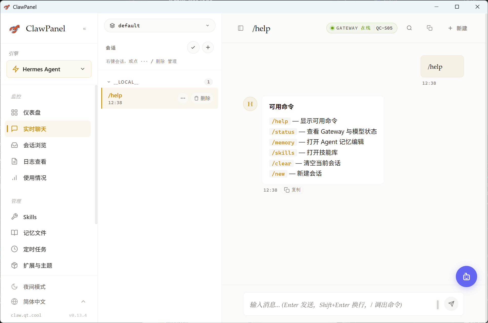
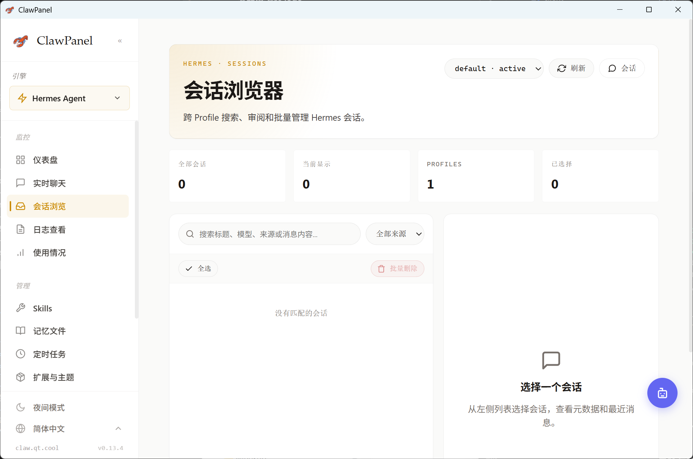
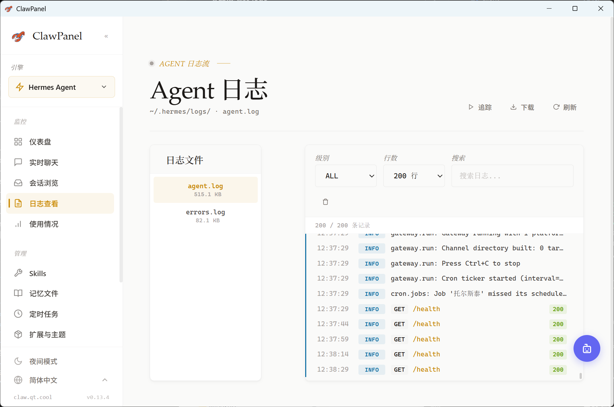

# Hermes Agent 图文指南

Hermes Agent 是 ClawPanel 支持的第二个 AI Agent 引擎。它把会话、长期记忆、人格档案、工具调用和消息渠道放在同一个管理面板中，让 Agent 从一次性的聊天窗口，升级为可以持续运营和沉淀上下文的智能体系统。

## 核心价值

- **长期记忆可视化**：通过 Notes、User Profile、Soul 三份 Markdown 文件沉淀事实、偏好和人格。
- **会话可运营**：统一查看会话、消息流、运行状态和工具调用细节。
- **人格可维护**：把 Agent 的表达风格、价值观、用户偏好固化为可编辑资产。
- **渠道可扩展**：面向 QQ、Telegram、Discord 等外部渠道，集中管理连接能力。

## 界面预览

### Hermes Agent 控制台

控制台用于查看 Hermes Agent 的整体运行状态、入口能力和主要管理模块，适合作为日常运营的第一屏。

### Agent 长期记忆

Agent 记忆页围绕三类长期上下文组织：笔记记录事实，用户画像记录偏好，灵魂档案塑造人格。所有内容都以 Markdown 形式保存，便于审计、迁移和版本管理。

### 会话与消息流

会话视图用于追踪 Agent 与用户之间的对话过程，帮助你观察消息上下文、响应质量和实际运行表现。

### 工具与运行细节

工具与运行细节用于定位 Agent 执行过程中的关键动作，适合排查问题、优化提示词和调整工具权限。

## 推荐使用流程

1. **先完成模型与 Gateway 配置**：确保 Hermes Agent 可以正常连接模型服务。
2. **初始化长期记忆**：在 Agent 记忆页补充 Notes、User Profile 和 Soul。
3. **进入会话验证效果**：通过对话确认人格、偏好和上下文是否按预期生效。
4. **接入消息渠道**：根据实际场景接入 QQ、Telegram、Discord 等外部渠道。
5. **持续迭代记忆资产**：把真实使用中沉淀下来的事实、偏好和规则整理回长期记忆。

## 与 OpenClaw 的关系

ClawPanel 采用多引擎架构：OpenClaw 适合已有 OpenClaw 生态用户的 Agent 管理和 Gateway 运维；Hermes Agent 则强化会话、记忆、人格和工具执行的长期运营体验。两者可以在同一个面板中统一管理。
